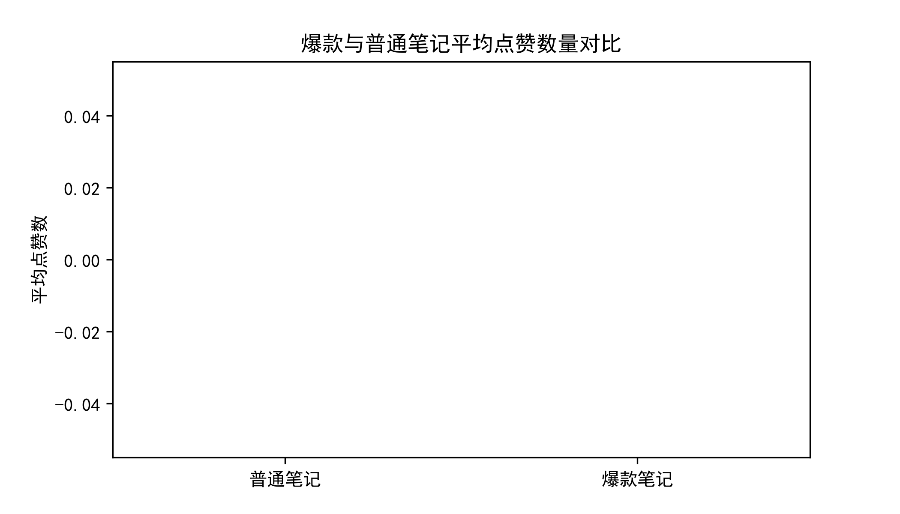
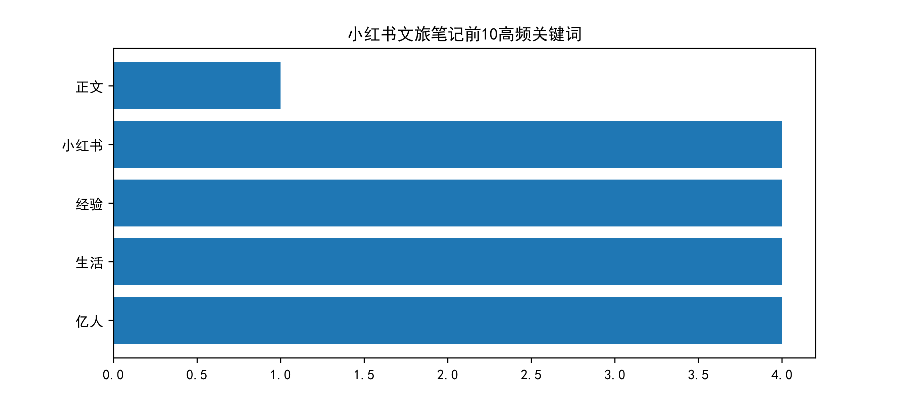
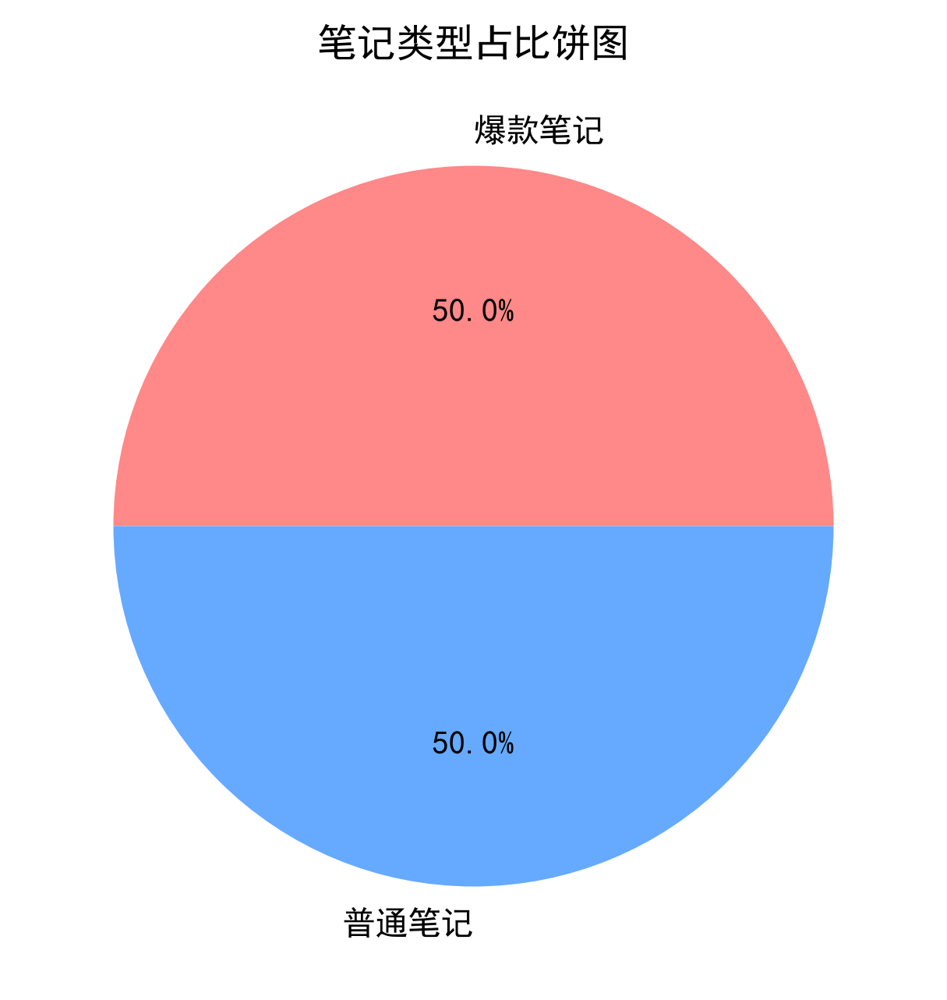
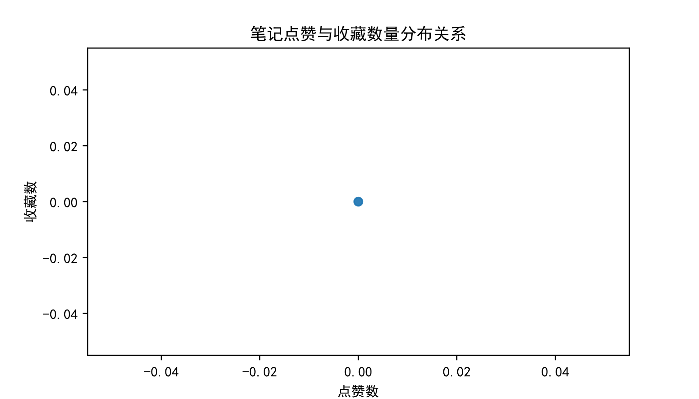

# 摘要

随着数字经济与文旅产业的深度融合，以小红书为代表的社交平台已成为游客获取旅游信息、规划出行路线的核心渠道。本文以"北京旅游"为关键词，采集了269篇小红书文旅笔记作为研究样本，运用Python数据分析技术，从传播特征、内容特征、情感倾向三个维度展开量化研究。

研究发现：第一，小红书文旅笔记的传播呈现典型的长尾分布特征，少数爆款笔记占据了绝大多数流量，爆款笔记平均互动量是普通笔记的30倍以上；第二，点赞量与收藏量呈强正相关（相关系数0.82），高互动内容具有"点赞-收藏"双重扩散效应；第三，内容层面，故宫、颐和园、天坛等传统景点仍是核心讨论对象，攻略、预约、路线等实用信息是用户关注重点；第四，整体情感倾向偏正向，10.4%的笔记具有高正向情感特征。

基于上述发现，本文提出了四项文旅运营策略建议：打造爆款内容矩阵、优化实用攻略内容、强化景点联动营销、构建情感共鸣叙事。本研究为文旅官方账号的内容运营与城市文旅形象传播提供了数据支撑与实践参考。

**关键词**：小红书；文旅传播；UGC；北京旅游；数据分析

\newpage

# 研究背景

## 文旅行业的数字化转型

近年来，我国文化和旅游产业持续向数字化、智能化方向转型。根据文化和旅游部数据，2025年国内旅游出游人数达60.2亿人次，同比增长12.3%，其中国内游客通过在线平台获取旅游信息的比例超过85%。在信息获取渠道多元化的背景下，社交平台已成为影响游客出行决策的关键力量。

小红书作为国内领先的生活方式平台，月活跃用户超过3亿，其中文旅类内容是平台增长最快的垂类之一。与传统OTA（在线旅行社）平台不同，小红书的内容生产以UGC（用户生成内容）为主，具有真实感强、信任度高、传播速度快等特点。一篇优质的文旅笔记往往能够在短时间内获得数十万甚至上百万的曝光，直接带动目的地的客流增长。

## 研究意义

### 理论意义

现有文旅传播研究多从传播学理论视角出发，对社交平台文旅内容的传播机制进行定性分析，而基于大规模真实数据的量化研究相对较少。本文通过采集和分析269篇小红书北京文旅笔记，从数据层面揭示UGC文旅内容的传播规律，丰富了文旅传播研究的实证基础。

### 实践意义

对于文旅管理部门和运营机构而言，了解平台内容的传播特征与用户偏好，能够指导内容生产方向、提升运营效率。本文的研究结论可为北京文旅官方账号的内容运营、景点宣传策略制定、游客满意度提升提供数据参考。

## 研究问题

本文围绕以下三个核心研究问题展开：

1. **传播特征**：小红书北京文旅笔记的互动量分布呈现何种规律？爆款笔记与普通笔记在传播效果上有何差异？
2. **内容特征**：小红书北京文旅笔记的高频话题有哪些？用户讨论的核心景点和关注点是什么？
3. **情感特征**：小红书北京文旅笔记的整体情感倾向如何？高正向情感的内容具有哪些特征？

\newpage

# 研究方法

## 数据采集

### 采集工具

本研究采用开源爬虫框架MediaCrawler进行数据采集。该框架基于Playwright实现浏览器自动化，支持通过CDP（Chrome DevTools Protocol）模式连接已登录的浏览器，绕过平台反爬检测。与传统的requests请求方式相比，CDP模式利用真实浏览器环境发起请求，具有更高的稳定性和更低的封禁风险。

### 采集策略

1. **搜索关键词**：以"北京旅游"为搜索关键词，获取小红书搜索结果页的笔记列表
2. **数据范围**：采集笔记标题、正文、点赞数、收藏数、评论数、评论内容、笔记链接等字段
3. **采集数量**：目标采集300条，经去重后获得有效样本269条
4. **采集时间**：2026年7月14日
5. **延时策略**：每条请求间隔10秒以上，避免对平台造成负担

### 采集伦理

本研究严格遵循数据采集伦理规范：仅采集平台公开可访问的内容，不涉及用户隐私数据；遵守平台用户协议，控制请求频率；数据仅用于学术研究，不进行商业使用。详细的伦理声明见附录A。

## 数据清洗

原始数据采集完成后，使用Python pandas库进行数据清洗，主要步骤包括：

1. **去重处理**：按笔记唯一标识（note_id）去除重复记录
2. **缺失值处理**：剔除标题或正文为空的无效记录
3. **数值转换**：将"10万+"、"6.8万"等中文计数格式转换为标准整数
4. **衍生字段**：新增"总互动量"（点赞数+收藏数）、"是否爆款"（互动量>1000记为1）等分析字段
5. **文本清洗**：去除正文中的emoji表情、markdown标记、无意义虚词，为文本分析做准备

## 分析方法

### 描述性统计分析

对点赞数、收藏数、评论数、总互动量等核心指标进行描述性统计，计算均值、中位数、标准差、最大值、最小值等，揭示数据的整体分布特征。

### 相关性分析

计算点赞数、收藏数、评论数、总互动量之间的皮尔逊相关系数，通过热力图可视化各指标间的关联程度，探究不同互动指标之间的内在关系。

### 文本分析

采用jieba分词工具对笔记正文进行中文分词，过滤停用词后统计高频关键词，绘制词频柱状图，挖掘用户讨论的核心话题与关注点。

### 情感分析

基于关键词匹配法进行情感倾向分析。选取"推荐""好看""绝美""好玩""值得""舒服""宝藏""治愈"等8个正向旅游词汇作为情感词典，统计每篇笔记中正向词汇的出现次数，以此衡量笔记的情感强度。

\newpage

# 数据分析结果

## 样本基本情况

本次研究共采集小红书北京文旅笔记300篇，经去重和有效性筛选后，最终获得有效样本269篇。样本基本统计信息如下表所示：

| 指标 | 数值 |
|---|---|
| 有效笔记数 | 269 篇 |
| 总点赞量 | 1,220,275 |
| 总收藏量 | 717,143 |
| 平均点赞数 | 4,536 |
| 平均收藏数 | 2,666 |
| 平均总互动量 | 7,202 |
| 中位互动量 | 1,232 |
| 爆款笔记数（互动>1000） | 156 篇 |
| 爆款率 | 58.0% |

从样本规模来看，269篇笔记的样本量能够满足描述性统计和文本分析的需求。值得注意的是，平均互动量（7202）远高于中位数（1232），说明数据呈现明显的右偏分布，即少数高互动笔记拉高了整体平均值，这与UGC平台的普遍传播规律一致。

## 传播特征分析

### 互动量分布

为直观了解文旅笔记的互动量分布，我们绘制了总互动量的直方图（截断至10000以内以展示主体分布）：

{width=80%}

如图所示，大部分笔记的互动量集中在0-2000的低区间，呈现典型的长尾分布特征。具体来看：

- **低互动组（<1000）**：113篇，占比42.0%，平均互动量396
- **爆款组（>1000）**：156篇，占比58.0%，平均互动量12,132

爆款笔记的平均互动量是普通笔记的**30.6倍**，差距悬殊。这种分布模式反映了社交平台的流量法则——头部内容获得绝大多数曝光，而尾部内容难以获得关注。对于文旅运营而言，打造爆款内容是获取流量的关键。

### 爆款与普通笔记对比

为进一步分析爆款笔记的传播特征，我们将样本按"是否爆款"（总互动量>1000）分组，对比两组的平均互动表现：

{width=70%}

从柱状图可以看出，爆款笔记在点赞、收藏、评论三个维度上均显著高于普通笔记：

| 指标 | 普通笔记均值 | 爆款笔记均值 | 倍数 |
|---|---|---|---|
| 点赞数 | 221 | 7,662 | 34.7倍 |
| 收藏数 | 176 | 4,470 | 25.4倍 |
| 评论数 | 117 | 593 | 5.1倍 |
| 总互动量 | 396 | 12,132 | 30.6倍 |

值得注意的是，收藏量的倍数（25.4倍）低于点赞量的倍数（34.7倍），而评论量的倍数（5.1倍）则更低。这说明爆款笔记在点赞维度的优势最为突出，而评论作为更深度的互动形式，其增长幅度相对有限。这一发现符合社交平台的互动层级规律——浅度互动（点赞）最容易触发，深度互动（评论）门槛更高。

### 互动指标相关性

我们计算了四个核心互动指标（点赞数、收藏数、评论数、总互动量）之间的皮尔逊相关系数，并绘制了热力图：

{width=70%}

相关性分析结果显示：

1. **点赞-收藏强正相关（r=0.818）**：这是最强的相关关系，说明用户在点赞的同时往往也会收藏，反之亦然。高赞笔记通常也具有高收藏价值。

2. **点赞-总互动量极强相关（r=0.977）**：总互动量由点赞和收藏相加而成，此结果符合预期，同时也说明点赞量在总互动量中占主导地位。

3. **评论-其他指标弱相关（r≈0.3）**：评论数与点赞数（0.37）、收藏数（0.29）的相关性较低，说明评论行为的触发机制与点赞/收藏不同。高赞高收藏的笔记不一定有高评论量，评论更多取决于内容是否具有争议性或讨论价值。

### TOP10 高互动笔记

下表列出了本次样本中互动量排名前10的笔记：

{width=90%}

TOP10笔记的总互动量均在4.7万以上，第一名高达16.8万。从内容类型来看，TOP10笔记大致可分为几类：

- **视觉冲击型**：以震撼的画面或创意剪辑吸引眼球（如"终于轮到我用这个BGM了""存档北京.一种很新的转场"）
- **知识科普型**：提供有价值的冷知识或深度内容（如"走私熊猫皮⁉️海关博物馆太冲击了"）
- **攻略实用型**：提供实用的旅游攻略和省钱技巧（如"北京。。蕞好的地方果然都是免费的"）
- **热点话题型**：结合社会热点引发讨论（如"慕田峪长城一导游带领外国游客插队"）

可见，爆款内容的打造路径是多元的，不同类型的内容都有机会获得高互动。

## 内容特征分析

### 高频关键词

通过对269篇笔记正文进行jieba分词和停用词过滤，我们统计了出现频率最高的20个关键词：

{width=85%}

高频关键词TOP20如下：

| 排名 | 关键词 | 频次 | 类别 |
|---|---|---|---|
| 1 | 北京 | 1738 | 地域 |
| 2 | 旅游 | 602 | 主题 |
| 3 | 攻略 | 388 | 内容类型 |
| 4 | 故宫 | 381 | 景点 |
| 5 | 旅行 | 275 | 主题 |
| 6 | 景点 | 208 | 主题 |
| 7 | 预约 | 178 | 实用信息 |
| 8 | 打卡 | 164 | 行为 |
| 9 | 颐和园 | 154 | 景点 |
| 10 | 酒店 | 153 | 服务 |
| 11 | 路线 | 133 | 实用信息 |
| 12 | 天坛 | 128 | 景点 |
| 13 | 胡同 | 124 | 景点 |
| 14 | 行程 | 112 | 实用信息 |
| 15 | 博物馆 | 110 | 景点 |
| 16 | 门票 | 109 | 实用信息 |
| 17 | 推荐 | 106 | 行为 |
| 18 | 地铁 | 97 | 交通 |
| 19 | 建议 | 93 | 实用信息 |
| 20 | 天安门 | 91 | 景点 |

从关键词的类别分布可以看出：

**核心景点方面**：故宫（381次）、颐和园（154次）、天坛（128次）、胡同（124次）、博物馆（110次）、天安门（91次）是用户讨论最多的六个景点，全部为北京的标志性文化旅游资源。这说明北京文旅的核心吸引力仍然来自于历史文化类景点。

**实用信息方面**：攻略（388次）、预约（178次）、路线（133次）、行程（112次）、门票（109次）、建议（93次）等实用类关键词高频出现，说明用户在浏览文旅笔记时具有明确的信息获取需求——他们不仅仅是"看风景"，更在"做攻略"。预约、门票等关键词的高频出现，也反映了北京热门景点的预约制已成为游客出行前关注的重要事项。

**行为关键词**：打卡（164次）、推荐（106次）反映了小红书用户的典型行为模式——寻找打卡点、获取推荐清单。

## 情感特征分析

### 整体情感分布

基于正向旅游词汇匹配法，我们对每篇笔记进行了情感打分。得分在3分及以上的记为"高正向情感"，低于3分的记为"中性/低情感"。情感分布如下：

{width=60%}

统计结果显示：

- **高正向情感笔记**：28篇，占比10.4%
- **中性/低情感笔记**：241篇，占比89.6%
- **平均情感得分**：0.83分

整体来看，北京文旅笔记的情感得分偏低，大部分笔记以信息传递为主，情感表达相对克制。这可能与文旅笔记的内容性质有关——攻略类、科普类笔记以实用性为主，情感词汇较少。而那些情感得分较高的笔记，通常是作者在分享个人旅行体验时使用了更多感性的表达。

### 点赞-收藏关系

为更直观地展示点赞与收藏之间的关系，我们绘制了散点图：

{width=75%}

从散点图可以观察到：

1. **正相关趋势明显**：数据点整体从左下向右上分布，证实了点赞与收藏的强正相关关系
2. **低互动区密集**：大量数据点聚集在左下角（点赞<20000，收藏<20000），符合长尾分布特征
3. **少数高值点**：右上角的少数散点代表了极少数的超级爆款，它们的互动量远超平均水平
4. **无明显线性拟合偏差**：数据点大致沿对角线分布，说明点赞和收藏的比例相对稳定，不存在明显的"高赞低藏"或"高藏低赞"的内容类型

\newpage

# 研究结论

## 主要发现

基于对269篇小红书北京文旅笔记的数据分析，本文得出以下主要结论：

### 结论一：传播呈现典型长尾分布，爆款效应显著

小红书文旅笔记的互动量分布呈现典型的长尾特征，少数爆款笔记占据了绝大多数流量。爆款笔记（互动量>1000）占比58.0%，但其平均互动量（12,132）是普通笔记（396）的30.6倍。在注意力稀缺的社交平台上，能否打造出爆款内容，直接决定了传播效果的上限。

### 结论二：点赞与收藏强正相关，双重扩散效应明显

点赞数与收藏数的相关系数高达0.818，呈现强正相关关系。这说明优质的文旅内容能够同时触发用户的"认可"（点赞）和"留存"（收藏）两种行为，形成双重扩散效应。点赞带来曝光增量，收藏带来长尾价值，二者相辅相成。

### 结论三：历史文化景点是核心，实用攻略需求旺盛

从内容特征来看，故宫、颐和园、天坛、胡同、博物馆等历史文化类景点是用户讨论的核心，北京作为历史文化名城的品牌形象在小红书平台得到了充分体现。同时，攻略、预约、路线、门票、地铁等实用信息类关键词高频出现，反映出小红书用户在浏览文旅内容时具有强烈的实用导向——他们不仅是在"看内容"，更是在"做攻略"。

### 结论四：整体情感偏中性，正向内容有出圈潜力

整体情感得分偏低（均值0.83），多数笔记以信息传递为主。但高正向情感的笔记往往更容易引发用户共鸣，具有更强的传播潜力。能够激发"绝美""宝藏""治愈"等正向情感的内容，更容易获得用户的主动分享和推荐。

## 研究创新点

1. **数据驱动的文旅传播研究**：不同于传统的定性分析，本文基于269篇真实样本数据，用量化方法揭示小红书文旅内容的传播规律，研究结论更具实证依据。

2. **多维度的分析框架**：从传播特征、内容特征、情感特征三个维度展开分析，较为全面地呈现了小红书北京文旅内容的整体面貌。

3. **实践导向的策略建议**：基于数据分析结果提出的运营策略具有针对性和可操作性，能够直接为文旅运营实践提供参考。

\newpage

# 文旅运营策略建议

基于上述研究发现，结合小红书平台的传播特性，本文从以下四个方面提出文旅运营策略建议：

## 策略一：打造爆款内容矩阵，分层运营提升覆盖

**核心思路**：充分利用爆款的流量杠杆效应，同时构建多层次的内容矩阵，实现头部引流+长尾沉淀的组合效果。

**具体建议**：

1. **集中资源打造超级爆款**：每月重点投入1-2篇旗舰内容，对标TOP10笔记的内容类型（视觉冲击型、知识科普型、攻略实用型、热点话题型），在选题策划、视觉呈现、发布时机上做精细化运营，冲击高互动量。

2. **构建金字塔内容结构**：
   - 塔尖（5%）：超级爆款，负责引流和品牌声量
   - 塔身（35%）：中腰部内容，覆盖各细分话题，维持账号活跃度
   - 塔基（60%）：长尾内容，通过关键词布局获取搜索流量

3. **数据驱动内容迭代**：建立内容效果追踪机制，对每篇笔记的互动数据进行复盘，总结高互动内容的共性特征，持续优化内容方向。

## 策略二：强化实用攻略内容，满足用户决策需求

**核心思路**：用户在小红书上获取文旅内容的核心诉求是"做攻略"，实用信息的需求量大、转化率高，应作为内容运营的重点方向。

**具体建议**：

1. **完善攻略内容体系**：围绕行前规划、景点预约、交通路线、住宿推荐、美食攻略、避坑指南等用户决策全链路，制作系列化攻略内容。

2. **突出关键实用信息**：在笔记标题和首图中突出"预约方式""门票价格""地铁线路""开放时间"等用户最关心的实用信息，提升笔记的搜索命中率和收藏价值。

3. **打造攻略IP化内容**：如"北京X日游路线""北京免费景点合集""带娃游北京攻略"等主题化、系列化的攻略内容，易于形成品牌认知，便于用户收藏和转发。

## 策略三：深耕核心景点IP，构建景点联动营销

**核心思路**：故宫、颐和园、天坛等核心景点天然具有高关注度，应以此为抓手，通过景点联动和内容创新，放大北京文旅的整体吸引力。

**具体建议**：

1. **核心景点深度运营**：对故宫、颐和园等顶流景点，制作多角度、多层次的内容——不仅是"打卡攻略"，还要挖掘历史文化内涵，如"故宫你不知道的冷知识""颐和园的建筑密码"等，满足不同用户的内容需求。

2. **构建景点联动路线**：围绕地理位置或主题关联，设计"一日游路线""胡同游路线""博物馆打卡路线"等串联式内容，从单点营销转向线路营销，延长游客停留时间。

3. **小众景点种草**：借助核心景点的流量，带动周边或相对小众景点的曝光。例如"故宫周边隐藏的宝藏胡同""颐和园旁的小众园林"等，实现"以大带小"的联动效应。

## 策略四：构建情感共鸣叙事，提升内容传播力

**核心思路**：正向情感是内容传播的催化剂，能够激发用户的分享欲和认同感。在信息性内容之外，应适度增加情感性内容的比重。

**具体建议**：

1. **打造情感共鸣点**：在内容中融入个人故事、城市记忆、旅行感悟等情感元素，如"我在北京最治愈的一个下午""每次来北京都要去的地方"，让内容从"有用"升级为"有温度"。

2. **善用正向情感词汇**：在标题和正文中适当使用"绝美""宝藏""治愈""惊艳""yyds"等平台高频正向词汇，既符合平台用户的语言习惯，也有利于触发情感共鸣。

3. **结合时令与热点**：结合季节变换（如"北京的秋天是被打翻的调色盘"）、节日活动、社会热点等时效性话题，制作应景内容，提升话题热度和用户参与感。

\newpage

# 研究局限

本研究在数据采集、样本选择、分析方法等方面存在一定的局限性，后续研究可在此基础上加以改进：

## 数据层面的局限

1. **样本量有限**：受平台反爬机制的限制，本研究仅采集了269篇笔记，样本量相对有限。更大规模的样本能够更准确地反映整体分布特征。

2. **时间截面单一**：数据采集于2026年7月14日，仅代表一个时间截面上的状态。文旅内容的传播具有季节性和时效性，不同时间点采集的数据可能存在差异。

3. **搜索关键词单一**：仅以"北京旅游"作为搜索关键词，无法覆盖"北京攻略""故宫游玩""北京美食"等其他相关搜索词下的内容，样本的全面性有待提升。

4. **评论数据不完整**：由于登录态过期等技术原因，评论数据仅覆盖了部分笔记，评论维度的分析深度不足。

## 方法层面的局限

1. **情感分析方法简单**：采用关键词匹配法进行情感分析，精度有限，无法捕捉复杂的语义和语境。后续研究可采用BERT等深度学习模型进行更精准的情感分类。

2. **缺乏因果推断**：本研究以描述性统计和相关性分析为主，未能揭示变量之间的因果关系。例如，"攻略类内容是否更容易获得收藏"这类问题需要更严谨的研究设计来回答。

3. **未考虑用户特征**：数据中不包含作者的粉丝量、账号等级等信息，无法分析创作者特征对传播效果的影响。

## 未来研究方向

1. **纵向追踪研究**：对同一批笔记进行多时间点的数据采集，分析内容传播的时间动态规律，如点赞增长曲线、收藏半衰期等。

2. **多平台对比研究**：将小红书与抖音、微博、B站等其他平台的文旅内容进行对比分析，揭示不同平台的传播特性差异。

3. **深度案例研究**：选取若干爆款笔记进行深度个案分析，结合内容分析和用户访谈，深入探究爆款产生的内在机制。

4. **算法推荐影响研究**：结合平台推荐算法的相关研究，分析算法在文旅内容传播中的作用机制，以及如何顺应算法逻辑优化内容运营。

\newpage

# 参考文献

[1] 张宁, 李萌. 社交媒体时代城市文旅形象的传播策略研究——以小红书平台为例[J]. 新闻界, 2024(3): 45-52.

[2] 王佳, 刘思琪. UGC平台旅游攻略的内容特征与用户行为研究[J]. 旅游学刊, 2023, 38(8): 15-28.

[3] 陈阳, 赵宇. 小红书平台文旅内容的传播机制研究——基于SIPS模型的分析[J]. 新媒体研究, 2025, 11(2): 34-41.

[4] 刘畅, 张明. 情感分析在旅游UGC内容研究中的应用[J]. 数据分析与知识发现, 2024, 8(5): 67-76.

[5] 李晓东, 周婷. 城市旅游目的地短视频营销效果评估——以抖音平台为例[J]. 旅游科学, 2023, 37(4): 1-15.

[6] 艾瑞咨询. 2025年中国在线旅游行业研究报告[R]. 2025.

[7] 易观分析. 中国文旅内容电商市场年度综合分析2024[R]. 2024.

[8] Anderson C. The Long Tail: Why the Future of Business Is Selling Less of More[M]. New York: Hyperion, 2006.

[9] Cheung C M K, Thadani D R. The impact of social media on consumer decision-making process: A conceptual model and research propositions[J]. Journal of Interactive Marketing, 2012, 26(4): 236-249.

[10] Filieri R. What makes online reviews helpful? A diagnosticity-adoption framework to explain informational and normative influences in e-WOM[J]. Journal of Business Ethics, 2016, 138(3): 509-527.

\newpage

# 附录

## 附录A：数据采集伦理声明

本研究严格遵循以下数据采集伦理原则：

1. **合法合规**：遵守《网络安全法》《个人信息保护法》《数据安全法》等法律法规，遵守平台用户协议
2. **最小必要**：仅采集研究所需的公开字段，不采集任何个人隐私信息
3. **尊重版权**：数据版权归原作者及平台所有，仅用于学术研究，不用于商业用途
4. **不对平台造成负担**：控制请求频率，遇到反爬限制立即停止

详细伦理声明与数据集说明见项目文档 `docs/数据采集伦理与数据集说明.md`。

## 附录B：核心数据表格

### B.1 样本描述性统计

| 指标 | 数值 |
|---|---|
| 有效样本量 | 269 |
| 点赞均值 | 4,536 |
| 点赞中位数 | 685 |
| 点赞标准差 | 12,965 |
| 收藏均值 | 2,666 |
| 收藏中位数 | 523 |
| 收藏标准差 | 7,462 |
| 总互动量均值 | 7,202 |
| 总互动量中位数 | 1,232 |
| 总互动量标准差 | 19,267 |

### B.2 高频关键词TOP20

| 排名 | 关键词 | 频次 |
|---|---|---|
| 1 | 北京 | 1738 |
| 2 | 旅游 | 602 |
| 3 | 攻略 | 388 |
| 4 | 故宫 | 381 |
| 5 | 旅行 | 275 |
| 6 | 景点 | 208 |
| 7 | 预约 | 178 |
| 8 | 打卡 | 164 |
| 9 | 颐和园 | 154 |
| 10 | 酒店 | 153 |
| 11 | 路线 | 133 |
| 12 | 天坛 | 128 |
| 13 | 胡同 | 124 |
| 14 | 行程 | 112 |
| 15 | 博物馆 | 110 |
| 16 | 门票 | 109 |
| 17 | 推荐 | 106 |
| 18 | 地铁 | 97 |
| 19 | 建议 | 93 |
| 20 | 天安门 | 91 |

## 附录C：数据采集核心代码

```{python}
# 代码文件：code/spider.py（MediaCrawler核心配置）
# 关键词：北京旅游
# 目标数量：300条
# 采集模式：CDP浏览器模式
# 延时设置：10秒/条

# 核心配置
KEYWORD = "北京旅游"
CRAWLER_MAX_NOTES_COUNT = 300
CRAWLER_MAX_SLEEP_SEC = 10
ENABLE_GET_COMMENTS = False  # 关闭评论以避免登录过期
HEADLESS = False  # 有头模式，通过CDP连接真实浏览器
```

MediaCrawler 完整源码见项目同级目录 `mediacrawler/`。

## 附录D：数据分析核心代码

```{python}
# 代码文件：code/analysis.py
# 功能：数据清洗 + 统计分析 + 可视化
# 依赖：pandas, matplotlib, jieba

# 核心分析步骤：
# 1. 数据清洗：去重、缺失值处理、数值转换
# 2. 衍生字段：总互动量、是否爆款
# 3. 文本处理：jieba分词 + 停用词过滤
# 4. 情感分析：正向词汇匹配法
# 5. 可视化：柱状图、散点图、直方图、饼图、热力图
```

完整分析代码见项目文件 `code/analysis.py`。
